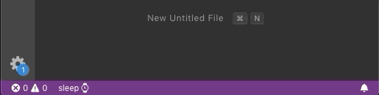

# Terminus

Shows terminal's status

## Features

Terminus gives the opportunity to parse integrated terminals outputs with regexp to show some custom status in the status bar.



## Extension Settings

The default ones:

```
"terminus.matches": [
	{
		"display": "$(error)",
		"expression": "[Ee]rror|[Ee]xception"
	},
	{
		"display": "$(alert)",
		"expression": "[Ww]arning"
	},
	{
		"display": "$(sync)",
		"expression": "[Rr]efresh(ing|ed){0,1}|[Rr]estart(ing|ed){0,1}|[Ss]tarted|[Rr]unning"
	}
]
```

You can override `"terminus.matches"` to set your own regexp.

`"display"` attribute accept any string. You may also use [Octicons](https://octicons.github.com/) like so `"$(error)"`.
